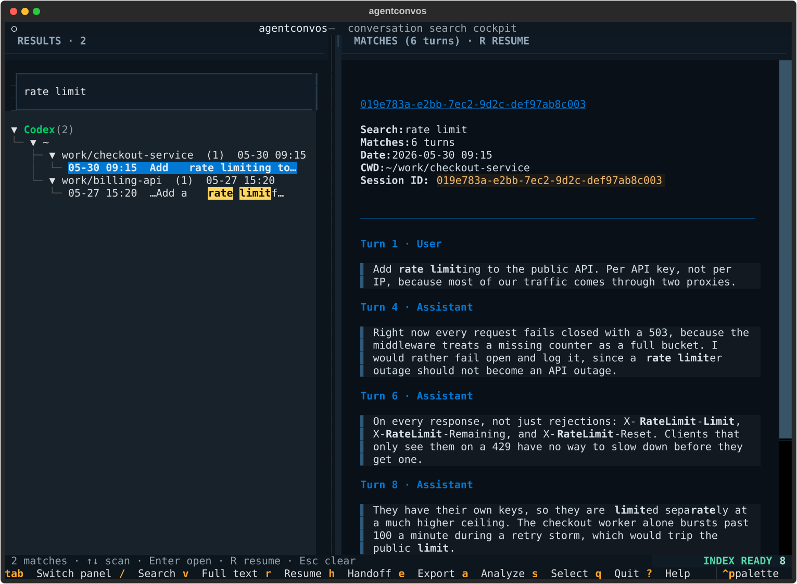
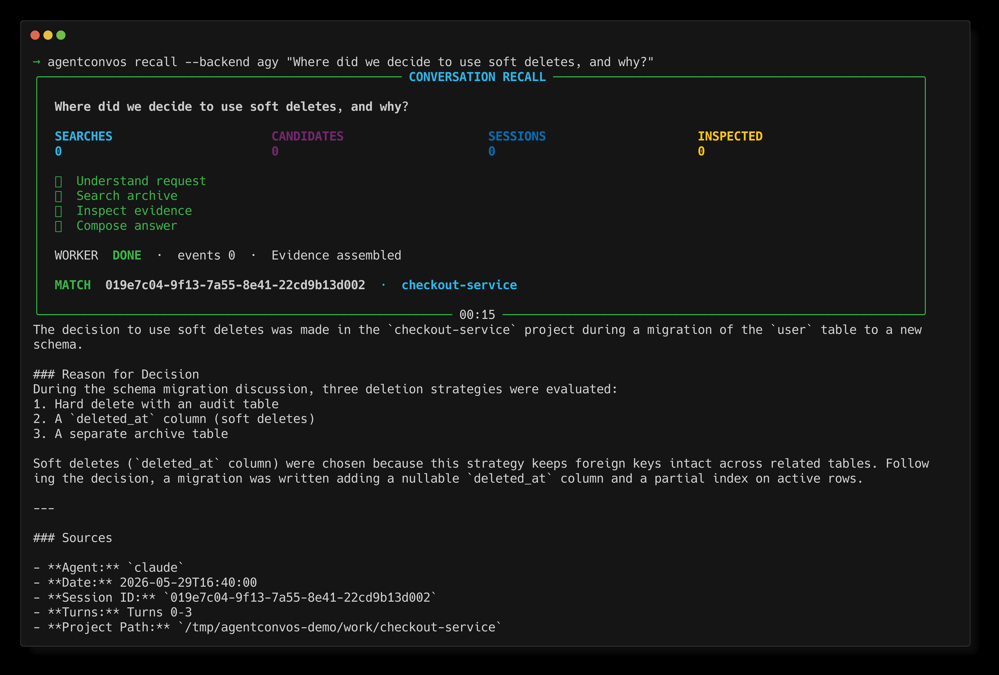
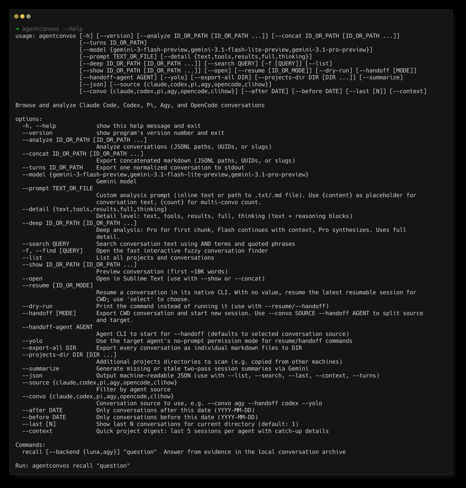
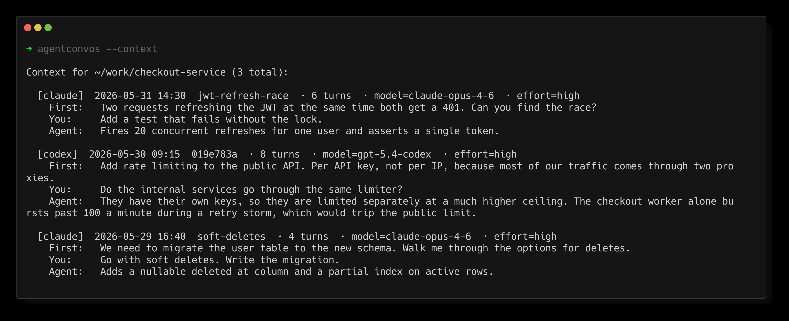
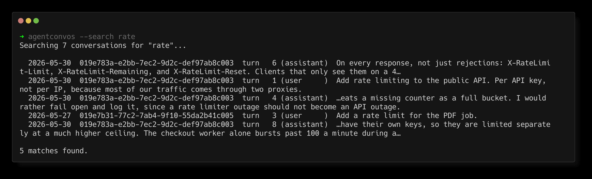

# agentconvos

[](https://github.com/testy-cool/agentconvos/actions/workflows/ci.yml)

Discover, query, and browse AI coding agent conversations. Works with Claude Code, Codex, Pi, Agy, OpenCode, and durable Clihow question threads.

Use as a **CLI** (`agentconvos --context --json`), a **Python library** (`from agentconvos import scan_projects`), or an **interactive TUI** (`agentconvos`).



Ask the archive a question in plain language and get an answer with citations:



## Install

```bash
uv tool install "agentconvos[ai] @ git+https://github.com/testy-cool/agentconvos.git"
```

Without Gemini analysis: drop `[ai]`. Requires Python 3.12+.

## CLI

<details>
<summary>Every option, from <code>agentconvos --help</code></summary>



</details>

### Project context (the fast path)

```bash
agentconvos --last              # most recent conversation for cwd
agentconvos --last 3            # last 3
agentconvos --context           # last 5 per agent, with fast catch-up details
agentconvos --context --json    # structured full messages for piping to agents
```



`--context` is the quick answer to “what was last discussed in this folder?” For
each coding-agent source it shows up to five recent conversations with their date,
turn count, model and effort, first user message, latest user message, latest agent
message, and cached summary. Terminal and JSON output preserve the complete
normalized message text. If Codex did not record a subagent's delegated prompt in
the child transcript, the first-message field labels the retained delegated-task
name instead. The terminal omits the latest-user field when it would duplicate the
first message. `--last N` remains the compact chronological view across all sources.

Generate or refresh the cached one-sentence summaries with `agentconvos --summarize`.
Each summary uses the complete normalized conversation in two Gemini passes: the first
builds a factual recap, and the second verifies and compresses it. The second request
extends the complete first request unchanged so sufficiently large sessions are eligible
for Gemini's implicit prompt caching. Cache files from the older final-five-turn pipeline
are regenerated automatically.

### Agentic recall

```bash
agentconvos recall "Where did we decide how scraper fallbacks should work?"
agentconvos recall --backend agy "Where did we decide how scraper fallbacks should work?"
```

`recall` searches the archive iteratively, opens only the promising conversation
turns, reconciles conflicting evidence, and answers with source, date, session,
turn, and project-path citations. The retrieval worker runs ephemerally in an
isolated workspace, treats transcript instructions as untrusted data, and keeps
its model and retrieval plumbing out of the caller-facing interface. It requires
an installed and authenticated Codex CLI by default. Use `--backend agy` to run
the same retrieval workflow through the local AGY bridge, which uses its Gemini
3.6 Flash high-thinking default; `--backend luna` keeps the existing Codex Luna
path explicit.

In an interactive terminal, recall renders a live cockpit with elapsed time,
retrieval stage, real search attempts, candidate and unique-session counts,
inspected conversations, archive coverage, worker activity, and the final matched
session. Piped use stays plain: progress goes to stderr without terminal control
codes, while stdout contains only the final evidence-backed answer.

### Search

```bash
agentconvos --search "auth middleware"
agentconvos --search 'auth "request id"'     # all words + an exact phrase
agentconvos --search "auth" --source claude --json
```



Search is case-insensitive. Separate words use AND matching across a conversation,
quoted text stays together as an exact phrase, and the strongest matches appear first.
CLI results come from a persistent turn-level SQLite index, so each hit includes the
original role and turn number without reparsing every transcript. Existing indexes
receive a one-time turn backfill on the first search; a large archive can take several
minutes once, after which only new or changed conversations are reindexed.

### Fast interactive find

```bash
agentconvos --find                    # open the fuzzy conversation picker
agentconvos -f "auth reqid"           # start with a fuzzy query
agentconvos -f --source codex         # limit the picker to one agent
agentconvos -f --source clihow       # find durable clihow research threads
```

This skips the Textual TUI and opens a lightweight `fzf` picker instead. It searches
cached session IDs, titles, paths, branches, first prompts, and saved summaries as you
type. The highlighted conversation is parsed lazily in the preview pane, so launching
the picker stays fast even with a large history. Press Enter to print the exact session
ID plus ready-to-copy `--show` and `--resume` commands. Requires `fzf` on `PATH`.

### List and filter

```bash
agentconvos --list
agentconvos --list --source codex --after 2026-05-01 --json
agentconvos --list --json | jq '.projects[].conversations[].summary'
```

### Durable Clihow question threads

`clihow` publishes each completed ask as a JSONL conversation under
`$CLIHOW_HOME/threads/*.jsonl` (default:
`~/.local/share/clihow/threads`). Files are mode `0600`, and agentconvos
indexes them as the first-class `clihow` source. The existing search index,
fzf preview, JSON listing, and Textual tree work with these conversations:

```bash
agentconvos --source clihow --search "MCP selector" --json
agentconvos --source clihow --list --json
agentconvos --resume THREAD_ID --dry-run
```

The resume command for a Clihow thread is deliberately:
`clihow ask --thread THREAD_ID`. It continues the logical research transcript
and restores its stored scope; it does not resume the native Claude, Codex, Pi,
Agy, or OpenCode session IDs cited in an answer. Use those native IDs with the
corresponding provider resume command when you want the original agent session.
Clihow threads use explicit UUIDs or the picker rather than a collision-prone
global `last`, and prior Clihow answers are navigation context that must be
verified against the underlying source conversations.

### Resume and handoff

```bash
agentconvos --resume                   # latest resumable session for cwd
agentconvos --resume select            # choose a session for cwd
agentconvos --resume <id>              # resume a specific session
agentconvos --resume <id> --yolo       # explicitly bypass the target agent's permission prompts
agentconvos --handoff                  # export context, start new session
agentconvos --handoff select           # pick from list
agentconvos --handoff codex            # latest Codex conversation
agentconvos --convo agy --handoff codex --yolo  # hand off latest Agy conversation into Codex with codex --yolo
agentconvos --convo agy --handoff claude --yolo # hand off latest Agy conversation into Claude with no prompts
agentconvos --handoff --handoff-agent codex   # hand off latest conversation into Codex
agentconvos --handoff --yolo           # hand off latest conversation to the same agent with no prompts
```

Resume and handoff preserve each agent's normal permission behavior by default.
`--yolo` is the explicit opt-in for agents that expose a no-prompt mode. Native
resume is available for Claude Code, Codex, Pi, Agy, and OpenCode conversations;
Clihow research threads use the explicit `clihow ask --thread` continuation
path above and have no provider-specific `--yolo` flag.

### Export

```bash
agentconvos --concat <id>              # markdown export
agentconvos --concat <id> --detail tools    # include tool call summaries
agentconvos --concat <id> --detail full     # include everything
agentconvos --turns <id> --json        # normalized user/assistant turns on stdout
```

`--turns` defaults to `--detail text`, which excludes tool calls, tool results,
reasoning blocks, and agent-injected bootstrap/command metadata. Use
`--detail tools`, `results`, `thinking`, or `full` for a targeted deeper export.

### Analyze with Gemini

Requires `GEMINI_API_KEY` env var or `.env` file. Get a key at [aistudio.google.com](https://aistudio.google.com/apikey).

```bash
agentconvos --analyze <id>
agentconvos --analyze <id1> <id2> --model gemini-3.1-pro-preview
agentconvos --analyze <id> --prompt "What tools were used most?"
```

### JSON output

`--json` works with `--list`, `--search`, `--last`, `--context`, and `--turns`.
Transcript output includes normalized indexed turns plus source, path, UUID, cwd,
size, and modification metadata.

## Library API

```python
from agentconvos import scan_projects, parse_jsonl, search, get_meta, get_stats

# Discover and filter
projects = scan_projects(source="claude", after="2026-05-01")

# Parse into normalized turns
turns = parse_jsonl(projects[0].conversations[0].path)

# Search across all sessions
hits = search([c.path for p in projects for c in p.conversations], "auth")

# Token and cost stats
stats = get_stats(projects[0].conversations[0].path)
```

## TUI

```bash
agentconvos
```

Interactive tree grouped by agent/source (Claude Code, Codex, Pi, Agy, OpenCode,
Clihow) with search, multi-select, preview, export, and Gemini analysis. The
`R` action continues Clihow threads through `clihow ask --thread`; it keeps
native provider resume distinct.

The history tree renders from cached metadata immediately. A persistent SQLite
full-text index updates in the background, with progress shown in the lower-right
badge; only new or changed transcripts are parsed on later starts. Search results
appear live while a first-time index is still filling.

The search box is focused at launch and searches titles, prompts, paths, branches,
summaries, and full conversation text. Matching context appears directly in the
tree. Arrow keys walk the results without leaving the search box, so you can type,
arrow to the conversation you want, and press Enter to open it. Conversation
previews parse lazily and highlight the matching turns. Resume asks for
confirmation with the agent, working directory, full session ID, and command.

Projects are ordered by their most recent conversation, with the project for the
current directory pinned first. Conversation titles come from the first message
you actually typed, so slash commands and harness boilerplate do not become the
name of a session.

Press `?` for the full key list. The headline keys:

| Key | Action |
|-----|--------|
| `/` | Focus full-text search |
| `↑` `↓` | Walk results while still typing |
| `Enter` | Open the highlighted conversation |
| `V` | Read the whole transcript, not just the tail |
| `R` | Review and resume session |
| `H` | Handoff to new session |
| `E` | Export markdown |
| `A` | Analyze with Gemini |
| `Y` | Copy the session ID |
| `S` | Toggle select |
| `Tab` | Switch panels |
| `?` | Every key |
| `Q` | Quit |

## File locations

| What | Where |
|------|-------|
| Claude Code logs | `~/.claude/projects/{project}/*.jsonl` |
| Codex logs | `~/.codex/sessions/*.jsonl`, `~/.codex/conversations/*.json` |
| Pi logs | `~/.pi/agent/sessions/**/*.jsonl` |
| Agy logs | `~/.gemini/antigravity-cli/history.jsonl`, `~/.gemini/antigravity-cli/conversations/*.db` |
| OpenCode sessions | `~/.local/share/opencode/opencode.db` |
| Clihow threads | `$CLIHOW_HOME/threads/*.jsonl` (default `~/.local/share/clihow/threads`) |
| Full-text search index | `~/.claude/convo-explorer/search-index.sqlite3` |
| Summaries | `~/.claude/convo-explorer/summaries/` |
| Analyses | `~/.claude/convo-explorer/analyses/` |

## Development

```bash
git clone https://github.com/testy-cool/agentconvos.git
cd agentconvos
uv sync            # installs the package plus pytest and ruff
uv run pytest      # full Python suite (~3 min, includes Textual timing tests)
uv run ruff check  # lint
cd tui && go test ./...   # Go picker suite
```

Every README image is a real capture of the program running against a synthetic
archive, so no private conversation appears in any of them. Rebuild them all with:

```bash
./scripts/make_readme_images.sh
```

It needs [termshot](https://github.com/homeport/termshot) and tmux on your PATH.
The command line images come from termshot. The browser image comes from Textual's
own SVG export, because a full screen app redraws over itself and termshot would
capture the whole session instead of the final screen.

## License

MIT
